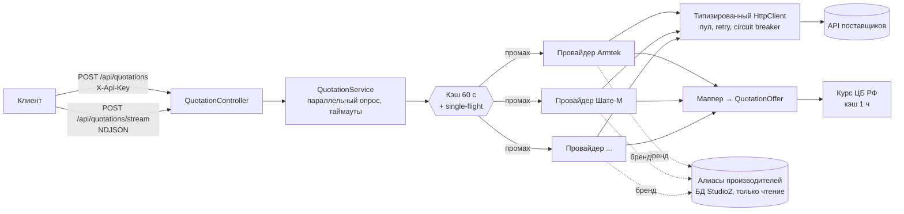

# SupplierQuotationApi

Сервис проценки поставщиков автозапчастей. Один `POST`-запрос с артикулом и брендом опрашивает
22 API поставщиков параллельно и возвращает предложения в **единой структуре**: цена, остаток, склад, срок,
кратность, валюта и цена в рублях, логотип поставщика и логин учётной записи, под которой сделана проценка.

Сервис самостоятельный: с Studio2 не связан ни кодом, ни хранилищем. Единственное обращение к базе Studio2 — чтение
таблицы алиасов производителей (см. [Алиасы производителей](#алиасы-производителей)), и оно необязательно.

- .NET 8, ASP.NET Core Web API, без собственной БД (кэш в памяти)
- 22 поставщика на 14 разных API: REST, SOAP, HTML-портал (несколько аккаунтов одного API работают одной реализацией)
- 207 автотестов

## Документация

| Где | Что |
|---|---|
| [quotation.mpsuper.ru/swagger](https://quotation.mpsuper.ru/swagger/index.html) | Интерактивный Swagger UI боевого сервиса: кнопка **Authorize** (`X-Api-Key`) и **Try it out** |
| [evgenibondarev.github.io/Supplier-Quotation-Api](https://evgenibondarev.github.io/Supplier-Quotation-Api/) | Справочная копия на GitHub Pages (без отправки запросов), обновляется вместе с репозиторием |
| [`docs/openapi.json`](docs/openapi.json) | Спецификация OpenAPI 3.0 для генерации клиентов и импорта в Postman |
| [`docs/architecture.md`](docs/architecture.md) | Архитектура и проектные решения |

## Содержание

- [Как это работает](#как-это-работает)
- [Быстрый старт](#быстрый-старт)
- [API](#api)
- [Swagger и OpenAPI](#swagger-и-openapi)
- [Единая модель предложения](#единая-модель-предложения)
- [Поставщики](#поставщики)
- [Алиасы производителей](#алиасы-производителей)
- [Docker](#docker)
- [Конфигурация](#конфигурация)
- [Как добавить поставщика](#как-добавить-поставщика)
- [Безопасность](#безопасность)
- [Известные ограничения](#известные-ограничения)
- [Разработка](#разработка)

## Как это работает



Ход одного запроса:

1. **Разбор запроса.** Проверяется `X-Api-Key`, поля запроса, список поставщиков (неизвестный ключ — `400`).
2. **Параллельный опрос.** Все выбранные (или все включённые) поставщики опрашиваются одновременно, время ответа равно времени
   самого медленного, а не сумме.
3. **Таймаут на поставщика** (20 с). Медленный не задерживает остальных и получает статус `Timeout`.
4. **Кэш результата** на 60 секунд по ключу `(поставщик, артикул, бренд, includeAnalogs)`. Одинаковые одновременные запросы
   делают один вызов к поставщику (single-flight), и отмена одного клиента не рвёт общий запрос.
5. **Провайдер** ходит в API поставщика через типизированный `HttpClient`: пул соединений, один retry, circuit breaker.
6. **Маппер** приводит ответ к единой модели, отбрасывает аналоги и чужие артикулы.
7. **Курс ЦБ РФ** (кэш 1 час) пересчитывает цены в рубли, если поставщик отдаёт другую валюту.
8. **Ошибка одного поставщика** не ломает ответ остальных: она приходит как статус `Error` с текстом.

Стриминговый вариант отдаёт результат каждого поставщика сразу по готовности, поэтому первые цены видны через сотни миллисекунд.

## Быстрый старт

```bash
git clone https://github.com/EvgeniBondarev/Supplier-Quotation-Api.git
cd Supplier-Quotation-Api

cp .env.example .env          # заполнить значения (секреты хранятся только здесь)
dotnet test                   # 207 тестов
dotnet run --project src/SupplierQuotationApi
```

Профиль запуска берётся из `launchSettings.json` (Development, Swagger по `/swagger`). Чтобы задать адрес и окружение явно:

```bash
ASPNETCORE_ENVIRONMENT=Production ASPNETCORE_URLS=http://localhost:5099 \
  dotnet run --project src/SupplierQuotationApi --no-build --no-launch-profile
```

Поставщик включается автоматически, если заполнены его переменные в `.env`. Пустой блок означает «выключен».
Вне окружения Development сервис не стартует без `APP__APIKEY`.

## API

Все запросы, кроме `/health`, `/swagger` и `/logos`, требуют заголовок `X-Api-Key`.

| Метод | Путь | Назначение |
|---|---|---|
| `POST` | `/api/quotations` | Проценка одним ответом |
| `POST` | `/api/quotations/stream` | Та же проценка потоком NDJSON: строка на поставщика по мере готовности |
| `POST`, `GET` | `/api/quotations/providers/{providerKey}` | Проценка у **одного** поставщика, не дожидаясь остальных |
| `GET` | `/api/quotations/providers` | Список поставщиков, их статус включения, логотипы, паспорта |
| `GET` | `/health` | Проверка живости |
| `GET` | `/swagger` | Документация (см. [Swagger и OpenAPI](#swagger-и-openapi)) |

### Запрос

`POST /api/quotations`

```json
{
  "article": "W28510",
  "brand": "WYNN'S",
  "providers": ["ShateM", "Armtek"],
  "includeAnalogs": false
}
```

| Поле | Тип | Обязательно | Описание |
|---|---|---|---|
| `article` | строка, 1–100 | да | Артикул. Разделители и регистр значения не имеют: `K1223A` = `K 1223A` = `k-1223a` |
| `brand` | строка, до 100 | нет* | Производитель. Написание может отличаться от каталога поставщика: сервис приводит его сам |
| `providers` | массив строк | нет | Ключи поставщиков. Пусто или не указано: опрашиваются все включённые |
| `includeAnalogs` | bool | нет | Кроссы и аналоги. По умолчанию только оригиналы запрошенного артикула |

\* Бренд обязателен для ML-Auto, Микадо и ZZap: без него они возвращают статус `Error` с пояснением.

```bash
curl -s -X POST http://localhost:5099/api/quotations \
  -H "X-Api-Key: $APP_API_KEY" -H "Content-Type: application/json" \
  -d '{"article":"K1223A","brand":"Filtron"}'
```

### Ответ

```json
{
  "article": "W28510",
  "brand": "WYNN'S",
  "requestedAtUtc": "2026-09-29T08:57:39.626035Z",
  "durationMs": 1734,
  "providers": [
    {
      "providerKey": "ShateM",
      "providerName": "Шате-М",
      "logoUrl": "http://localhost:5099/logos/shatem.svg",
      "accountLogin": "<логин учётной записи>",
      "status": "Ok",
      "error": null,
      "durationMs": 1733,
      "offers": [
        {
          "offerId": "035C2148…",
          "productName": "Присадка в топливо (дизель)",
          "brand": "WYNNS",
          "article": "W28510",
          "description": "Присадка для дизельного топлива WYNNS DIESEL ADDITIVE 250мл.",
          "productUrl": null,
          "warehouse": "Привольный (Центральный склад Привольный)",
          "stock": 8,
          "stockText": "8",
          "minOrderQuantity": 1,
          "deliveryDaysMin": 2,
          "deliveryDaysMax": 2,
          "price":    { "amount": 82.62,   "currency": "BYN" },
          "priceRub": { "amount": 2304.84, "currency": "RUB" },
          "priceNote": "Возврат невозможен. Для подбора запчастей рекомендуем использовать каталоги производителей.",
          "providerData": {
            "articleId": "242434472",
            "locationCode": "SHATE-S01",
            "agreementCode": "<код договора>",
            "priceHash": "1661401022",
            "multiplicity": "1",
            "supplyRating": "0"
          }
        }
      ]
    }
  ]
}
```

### Один поставщик, не ожидая остальных

`POST /api/quotations/providers/{providerKey}` (и то же через `GET` с параметрами в адресе) возвращает результат **одного** поставщика:
тот же объект `ProviderQuotation`, что и элемент `providers[]` общего ответа. Запрос нужен, когда результаты показываются по мере готовности:
вызовите его для каждого поставщика параллельно и выводите ответы по мере прихода, не дожидаясь самого медленного (обычно ZZap).

```bash
curl -s -X POST http://localhost:5141/api/quotations/providers/ShateM \
  -H "X-Api-Key: $APP_API_KEY" -H "Content-Type: application/json" \
  -d '{"article":"K1223A","brand":"Filtron"}'

# то же через GET
curl -s -H "X-Api-Key: $APP_API_KEY" \
  "http://localhost:5141/api/quotations/providers/ShateM?article=K1223A&brand=Filtron"
```

- Тело POST: `article`, `brand`, `includeAnalogs` (списка `providers` нет, поставщик в адресе). Ключ поставщика не зависит от регистра.
- Кэш результатов и очередь ZZap **общие** с `POST /api/quotations`: после одиночных запросов общий запрос по тем же данным отвечает из кэша за миллисекунды,
  и поставщик не вызывается второй раз.
- Выключенный поставщик, таймаут и сбой приходят статусом `Disabled`, `Timeout`, `Error`, как и в общем ответе (HTTP 200).
- `404` — неизвестный ключ поставщика, `400` — пустой артикул.

Пример параллельной проценки по шести поставщикам (K1223A / Filtron): результаты появлялись через 0,6 с (Фаворит), 0,7 с (Берг), 1,1 с (АВД),
1,3 с (Nikei), 2,9 с (ZZap) и 3,1 с (Шате-М), тогда как общий запрос отдаёт всё только после самого медленного.

### Статусы поставщика

| `status` | Значение |
|---|---|
| `Ok` | Есть предложения |
| `NoOffers` | Запрос выполнен, предложений нет |
| `Error` | Ошибка поставщика или запроса; текст в `error` (нет доступа, нужен бренд, превышена квота и т. д.) |
| `Timeout` | Поставщик не ответил за 20 секунд |
| `Disabled` | Поставщика явно запросили, но не заполнены его переменные |

### Пример ошибки поставщика

Ошибка одного поставщика приходит внутри ответа, остальные работают штатно:

```json
{
  "providerKey": "ZZapMoscow",
  "providerName": "ZZap Москва",
  "status": "Error",
  "error": "ZZap ищет только по паре артикул + бренд: укажите бренд.",
  "durationMs": 17,
  "offers": []
}
```

### Стриминг

`POST /api/quotations/stream` принимает тот же запрос и отвечает `application/x-ndjson`: одна строка JSON на поставщика,
в порядке готовности. Каждая строка — тот же объект поставщика, что и элемент `providers[]` (значения ниже примерные):

```
{"providerKey":"FavoritParts","status":"Ok","durationMs":112,"offers":[ … ]}
{"providerKey":"Avd","status":"Ok","durationMs":330,"offers":[ … ]}
{"providerKey":"ZZapMoscow","status":"Ok","durationMs":3607,"offers":[ … ]}
```

### Ошибки самого сервиса

| Код | Когда |
|---|---|
| `400` | В `providers` неизвестный ключ, пустой артикул |
| `401` | Нет заголовка `X-Api-Key` или он неверный |

## Swagger и OpenAPI

Интерактивная документация и машиночитаемая спецификация OpenAPI 3.0 строятся из кода и XML-комментариев:

| Адрес | Что |
|---|---|
| `/swagger` | Swagger UI: описание сервиса, таблица поставщиков, методы, примеры запросов и ответов, кнопка **Authorize** для `X-Api-Key` |
| `/swagger/v1/swagger.json` | OpenAPI-документ для генерации клиентов и импорта в Postman |
| [`docs/openapi.json`](docs/openapi.json) | Копия документа в репозитории |

Что описано в документе:

- шапка с правилами работы: ошибка одного поставщика не ломает ответ, таймауты, кэш, бренды и алиасы, аналоги, валюты, сроки, ограничения по IP, лимит ZZap;
- таблица всех поставщиков и подробный паспорт каждого в `GET /api/quotations/providers` (протокол, авторизация, валюта, обязательность бренда, аналоги, лимиты, заметки, ссылка на документацию);
- у каждого поля модели есть описание и единицы измерения; значения `QuotationStatus` расшифрованы;
- поле `providers` запроса содержит допустимые ключи (`enum`), Swagger UI показывает их списком;
- примеры: четыре запроса (по бренду, выбранные поставщики, с аналогами, без бренда), ответ с предложениями, ответ с ошибкой, таймаутом и выключенным поставщиком, поток NDJSON, `400` и `401`;
- схема безопасности `ApiKey` (заголовок `X-Api-Key`) применена ко всем методам.

Вне Development документ по умолчанию скрыт. Включить: `APP__SWAGGERENABLED=true` (секретов в документе нет, но он раскрывает список поставщиков). На боевом сервере включён: см. [Документация](#документация).

Страница GitHub Pages (`docs/index.html`) показывает ту же спецификацию без отправки запросов и берёт её из `docs/openapi.json`, поэтому отдельного обновления не требует.

Документ проверяется тестами: ключи в `enum` совпадают с зарегистрированными провайдерами, у каждого провайдера есть паспорт в `ProviderCatalog`,
примеры десериализуются в реальные типы контракта, а `docs/openapi.json` совпадает с генерируемым. После изменения контракта или
комментариев обновите файл:

```bash
UPDATE_OPENAPI=1 dotnet test --filter Document_MatchesCommittedFile
```

## Единая модель предложения

| Поле | Описание |
|---|---|
| `offerId` | Устойчивый идентификатор предложения у поставщика (для заказа и корзины) |
| `productName`, `brand`, `article` | Товар как его назвал поставщик |
| `description`, `productUrl` | Описание и ссылка, если поставщик их отдаёт |
| `warehouse` | Склад или направление. У агрегаторов (АВД, ZZap) — поставщик и точка выдачи |
| `stock` | Остаток числом. `null` — не удалось разобрать или скрыт |
| `stockText` | Остаток в исходном виде: `>10`, `под заказ`, `Заказ` |
| `minOrderQuantity` | Кратность заказа |
| `deliveryDaysMin`, `deliveryDaysMax` | Срок в днях, `null` — не указан |
| `price` | Цена закупки в валюте поставщика: `{amount, currency}` |
| `priceRub` | Цена в рублях по курсу ЦБ РФ. `null` — курс неизвестен |
| `priceNote` | Условия: возврат, ограничения, подпись источника |
| `providerData` | Служебные данные точного предложения для заказа (склад, токены, коды). Секретов внутри нет |

Имена полей отличаются от исходных данных Studio2: `Caption` → `productName`, `Producer` → `brand`, `Direction` → `warehouse`,
`Rest` → `stock` и `stockText`, `MinQuantity` → `minOrderQuantity`, `SourcePrice` → `price`.

## Поставщики

Ключ провайдера используется в поле `providers` запроса. Переменные окружения всех поставщиков имеют общий вид
`SUPPLIERS__<ПОСТАВЩИК>__<ПОЛЕ>`. Описание документации: где в Studio2 указана официальная ссылка, приведена она.
Если публичной ссылки нет, значит, документацию поставщик выдаёт менеджерам или после авторизации.

| Ключ | Поставщик | Протокол и авторизация | Валюта | Бренд | Официальная документация и адрес API |
|---|---|---|---|---|---|
| `ShateM` | Шате-М | REST, Bearer-токен по логину и паролю | BYN | нет | [api-doc.shate-m.ru](https://api-doc.shate-m.ru/) |
| `Armtek` | Армтек (Россия) | REST form-POST, Basic; сбытовая организация 4000 | RUB | нет | [ws.armtek.ru](https://ws.armtek.ru/) (просмотр требует Basic-авторизации) |
| `ArmtekBy` | Армтек BY | То же, аккаунт Беларуси, организация 2000 | BYN | нет | [ws.armtek.ru](https://ws.armtek.ru/) |
| `FavoritParts` | Фаворит Союз | REST, ключи `key` и `developerKey` в query | RUB | нет | API `https://api.favorit-parts.ru`, личный кабинет [lk.favorit-parts.ru](https://lk.favorit-parts.ru/) |
| `FavoritPartsIstra` | Фаворит Истра | То же, отдельный аккаунт | RUB | нет | то же |
| `FavoritPartsRostov` | Фаворит Ростов | То же, отдельный аккаунт | RUB | нет | то же |
| `ForumAuto` | Форум-Авто (Союз) | REST, логин и пароль в query | RUB | нет | API `https://api.forum-auto.ru/v2`, кабинет [itrade.forum-auto.ru](https://itrade.forum-auto.ru/) |
| `ForumAutoInterparts` | Форум-Авто (Интерпартс) | То же, отдельный аккаунт | RUB | нет | то же |
| `ForumAutoPiter` | Форум-Авто (Питер) | То же, отдельный аккаунт | RUB | нет | то же |
| `ForumAutoRostov` | Форум-Авто (Ростов) | То же, отдельный аккаунт | RUB | нет | то же |
| `ForumAutoIstra` | Форум-Авто (Истра) | То же, отдельный аккаунт | RUB | нет | то же |
| `Avd` | АВД | SOAP 1.1, логин и пароль в теле | RUB | нет | [avdmotors.ru/p/web-service-pokupatelya](https://www.avdmotors.ru/p/web-service-pokupatelya) |
| `Berg` | Берг | REST v1.0, ключ в заголовке `X-Berg-API-Key` | RUB | нет | API `https://api.berg.ru` |
| `Motex` | МоТехС | REST, Bearer по логину и паролю; **доступ по белому списку IP** | BYN | нет | API `https://api.motexc.by` |
| `MlAuto` | ML-Auto BY | form-POST, логин и пароль в теле | BYN | **да** | API `https://www.ml-auto.by/webservice` |
| `MlAutoRu` | ML-Auto RU | То же, контур России | RUB | **да** | API `https://ml-auto.ru/webservice` |
| `MoskvorechieIstra` | Москворечье (Истра) | HTML-портал (cookie, windows-1251) и запасной JSON API | RUB | нет | портал `https://portal.moskvorechie.ru/` |
| `ProfitLiga` | Профит-Лига | REST v1.4, ключ `secret` в query | RUB | нет | API `https://api.pr-lg.ru` |
| `Japarts` | Japarts | GET с `login` и `pass` в query, windows-1251 | RUB | нет | сайт `https://www.japarts.ru/` |
| `Nikei` | Nikei | REST, Basic | RUB | нет | API `https://nikei.ru` |
| `MikadoMskHod20` | Микадо (МскХод20) | SOAP 1.1 (ASMX), ClientID и пароль в теле; **доступ по IP** | RUB | **да** | `https://www.mikado-parts.ru/ws1` (`service.asmx`, `basket.asmx`), namespace `http://mikado-parts.ru/service` |
| `ZZapMoscow` | ZZap Москва | REST, ключ в заголовке `zzap-api-key` | RUB | **да** | [wiki.zzap.ru/category/api-new](https://wiki.zzap.ru/category/api-new/), [swagger](https://b52-api.zzap.pro/swagger/v1/swagger.json) |

Замены и кроссы (`includeAnalogs`) поддерживают Шате-М, Армтек, Фаворит (только вместе с брендом), Форум-Авто и Берг.
Остальные всегда отдают только оригиналы.

### Особенности отдельных поставщиков

| Поставщик | Что нужно знать |
|---|---|
| Шате-М | В `articles/search` бренд обязателен, поэтому сервис ищет по коду (все бренды) и выбирает нужный локально. Названия складов берутся из справочника (кэш 30 минут). |
| Армтек | Для российского аккаунта поиск находит предложения только при заданном адресе доставки (`DELIVERYKUNNR`). Есть суточная квота: после исчерпания аккаунт блокируется на 30 минут. Каноническая пара артикул и бренд берётся из `assortment_search`. |
| Фаворит | Срок считается по московской дате. Бренд в API передаётся только вместе с аналогами. |
| Форум-Авто | Каталог общий, склады и цены у аккаунтов свои. Бренд в API не передаётся: он требует точного написания, поэтому фильтрация локальная. |
| АВД | Агрегатор: в каждой строке свой поставщик и регион. В ответе `offerId` — `Hash`, нужный для добавления в корзину. Символ `/` в конце адреса ломает endpoint. |
| Берг | Параметр `brand_name` API игнорирует. Без адреса отгрузки нет дат доставки: используется первый активный адрес аккаунта. |
| МоТехС | Ответ приходит в конверте `{status, messages, response}`. Работает только с IP из белого списка клиента. |
| ML-Auto | Бренд нужен в точном написании: пробуется исходное, очищенное (`WYNN'S` → `WYNNS`) и алиасы. Тело ответа начинается с BOM. |
| Москворечье | Основной путь — портал (склад, остаток, срок). Запасной JSON API вызывается только без бренда: с брендом он способен вернуть чужого производителя. |
| Профит-Лига | PHP отдаёт пустые коллекции массивом, а непустые объектом. Срок приходит в часах. |
| Japarts | **API не экранирует значения в SQL:** апостроф в бренде даёт `Software error` с текстом запроса. Такие значения на сервер не отправляются. |
| Nikei | Без бренда возвращает список брендов номера: он используется как запасной путь поиска. |
| Микадо | Если `Message` не `Ok`, это ошибка (неверный логин или namespace), а не «нет данных». Порядок полей SOAP значим. |
| ZZap | Агрегатор продавцов. Не чаще 1 запроса в 3,5 с на весь ключ (иначе 429 и капча), поэтому запросы идут по очереди. Отдаются 20 самых дешёвых предложений. Обязательна подпись источника, см. `priceNote`. |

## Алиасы производителей

Поставщики называют бренды по-разному: в заказе `Kayaba`, у Берг, Армтек и ML-Auto — `KYB`. Без словаря такие предложения
отбрасываются как чужой бренд. Словарь лежит в таблице `OneCProducerAliases` базы Studio2 и читается сервисом сам:

- значения кэшируются на 30 минут, нормализация и схлопывание цепочек `A → B → C` повторяют Studio2;
- сессия открывается в режиме `READ ONLY`, запрашивается одна таблица;
- общее правило сравнения брендов: нормализация, алиас, вхождение (`MAHLE` ↔ `MAHLE ORIGINAL`);
- API поставщиков с точным поиском получают несколько написаний: исходное, очищенное и алиасы;
- база недоступна или не настроена: сервис пишет предупреждение, работает без алиасов и повторяет попытку через две минуты.

Пример на `RA5442` / `Kayaba`: без алиасов Berg, Armtek RU, Armtek BY и ML-Auto ничего не находят, с алиасами — 3, 3, 4 и 1
предложения (бренд `KYB`).

Рекомендуется отдельный пользователь БД с правом только на чтение этой таблицы:

```sql
CREATE USER 'quotation_ro'@'%' IDENTIFIED BY '<пароль>';
GRANT SELECT ON ST2.OneCProducerAliases TO 'quotation_ro'@'%';
```

## Docker

В репозитории есть `Dockerfile` (многоэтапная сборка, образ около 360 МБ) и `docker-compose.yml`.

```bash
cp .env.example .env                 # заполнить значения
docker compose up -d --build         # сервис на http://localhost:8080
PORT=9000 docker compose up -d       # другой порт
docker compose logs -f
```

- Секреты в образ не попадают: `.env` исключён в `.dockerignore`, значения передаются при запуске (`env_file`). Кавычки вокруг значений
  в `.env` compose снимает сам; у `docker run --env-file` кавычки остаются в значениях, поэтому без compose монтируйте файл:
  `docker run -p 8080:8080 -v "$PWD/.env:/app/.env:ro" supplier-quotation-api`.
- Контейнер работает не от root (пользователь `app`), файловая система только для чтения, все capabilities сброшены.
- Проверка живости встроена в образ (`HEALTHCHECK` на `/health`), статус виден в `docker ps`.
- Окружение по умолчанию Production: Swagger скрыт, включается `APP__SWAGGERENABLED=true`. Редирект на https в Production выключен: TLS снимается на прокси.
- За nginx или другим прокси раскомментируйте `ASPNETCORE_FORWARDEDHEADERS_ENABLED` в compose-файле, иначе `logoUrl` в ответах будет с внутренним адресом.
- Контейнеру нужен доступ к API поставщиков и, для алиасов производителей, к базе Studio2 (`STUDIO2DB__CONNECTIONSTRING`). МоТехС и Микадо
  разрешают доступ по IP: адрес должен быть внешним адресом сервера, где запущен контейнер.

## Конфигурация

Все секреты и настройки лежат в одном файле `.env`. Файл не попадает в репозиторий, шаблон без значений — `.env.example`.
Формат один для всех: `SUPPLIERS__<ПОСТАВЩИК>__<ПОЛЕ>` (двойное подчёркивание означает вложенность конфигурации ASP.NET,
регистр не важен).

| Группа | Переменные |
|---|---|
| Сервис | `APP__APIKEY`; необязательные `APP__PROVIDERTIMEOUTSECONDS` (20), `APP__RESULTCACHESECONDS` (60), `APP__SWAGGERENABLED` (только Development) |
| База алиасов | `STUDIO2DB__CONNECTIONSTRING` (пусто — алиасы выключены) |
| Логин и пароль | `…__BASEURL`, `…__LOGIN`, `…__PASSWORD`: Шате-М, АВД, Japarts, Nikei, ML-Auto ×2, Форум-Авто ×5, МоТехС. У Армтека вместо логина `…__USER` |
| Ключи | `…__APIKEY`: Берг, ZZap. Москворечье: `…__LOGIN`, `…__APIKEY`, `…__PORTALPASSWORD`. У Профит-Лиги `…__SECRET` |
| Особые поля | Армтек: `DEFAULTVKORG`, `BUYERKUNNR`, `DELIVERYKUNNR`. Фаворит: `CLIENTKEY`, `DEVELOPERKEY`. Микадо: `CLIENTID`. Москворечье: `PORTALPASSWORD`. Берг: `DELIVERYADDRESSID`. МоТехС: `CURRENCY`. ZZap: `CODEREGION`, `MINREQUESTINTERVALMS` |

## Как добавить поставщика

Одна папка и одна строка регистрации:

```
src/SupplierQuotationApi/Providers/<Имя>/
  <Имя>Options.cs       // привязка SUPPLIERS__<ИМЯ>__*
  <Имя>Client.cs        // HTTP-клиент, DTO ответа
  <Имя>Mapper.cs        // DTO → QuotationOffer, чистая функция
  <Имя>Provider.cs      // реализация IQuotationProvider
  <Имя>Extensions.cs    // services.Add<Имя>(configuration)
```

Затем в `Program.cs`: `builder.Services.Add<Имя>(builder.Configuration);`.

Контракт провайдера:

```csharp
public interface IQuotationProvider
{
    string Key { get; }            // стабильный ключ, попадает в запрос
    string Name { get; }
    string? LogoFile { get; }      // файл в wwwroot/logos или http(s)-ссылка
    string? AccountLogin { get; }  // логин учётной записи, под которой идут запросы
    bool IsEnabled { get; }        // true, если заполнены переменные
    Task<IReadOnlyList<QuotationOffer>> SearchAsync(QuotationSearch search, CancellationToken ct);
}
```

Правила:

- HTTP-клиенты регистрируются только через `AddProviderHttpClient` (пул, retry, circuit breaker, таймауты), свои `HttpClient` не создаются;
- несколько аккаунтов одного API (Форум-Авто ×5, Фаворит ×3, Армтек ×2) — одна реализация и несколько экземпляров с разными ключами;
- контракт «только оригиналы запрошенного артикула»: кроссы фильтруются в провайдере;
- бренд сравнивать через `ProducerAliasMap.Matches`, а не вручную;
- у API, которые принимают бренд только в точном написании, использовать `ProducerAliasMap.QueryVariants`;
- API-ошибки бросать исключением: сервис превратит его в статус `Error` с текстом.

## Безопасность

Репозиторий публичный, поэтому:

- секреты хранятся только в `.env` (в `.gitignore`, права 600); в репозитории нет ни значений, ни адресов БД;
- у нескольких API (Фаворит, Форум-Авто, Профит-Лига, Japarts) ключ или пароль передаётся в URL, поэтому логирование URL исходящих
  запросов отключено (`System.Net.Http.HttpClient: Warning`), а в логах секреты не появляются;
- в `accountLogin` для API без логина отдаётся метка (`api-key`) или начало ключа, но не сам секрет;
- внешние клиенты авторизуются заголовком `X-Api-Key`, сравнение выполняется за постоянное время;
- значения, которые ломают SQL у Japarts, не отправляются ему вообще;
- база Studio2 используется только на чтение, рекомендуется отдельный пользователь с правом `SELECT`.

Логотипы поставщиков принадлежат их владельцам и лежат в `wwwroot/logos` только для отображения в ответах.

## Известные ограничения

- **МоТехС и Микадо** работают только с IP из белого списка клиента. С других адресов МоТехС возвращает `Error` «Нет доступа. Проверьте IP адрес».
- **ZZap** отвечает по очереди (не чаще 1 запроса в 3,5 с): при пачке запросов одному клиенту это самый медленный источник.
  Стриминг отдаёт остальных поставщиков раньше.
- **Цены ML-Auto BY** пересчитаны из BYN по курсу и показывают срок до склада в Минске: для российского заказа их нужно проверять отдельно.
- **Дешёвые позиции ZZap со сроком 30–90 дней** попадают в результат, срочность нужно фильтровать по `deliveryDaysMin`.
- **Только оригиналы** для поставщиков, которые не поддерживают `includeAnalogs`.
- **Заказ и корзина** не реализованы: сервис только читает цены. Поля `offerId` и `providerData` подготовлены для будущего оформления.

## Разработка

```bash
dotnet build          # должно быть 0 предупреждений
dotnet test           # 207 тестов: ядро, маппинг и разбор ответов каждого поставщика, клиенты на заглушках, Swagger
```

Структура:

```
src/SupplierQuotationApi/
  Controllers/        HTTP-слой без логики
  Contracts/          публичные модели запроса и ответа
  Core/               QuotationService, кэш и single-flight, курс ЦБ, алиасы производителей
  Infrastructure/     загрузка .env, X-Api-Key, HTTP-клиенты
  Providers/<Имя>/    по папке на поставщика
  wwwroot/logos/      логотипы
tests/SupplierQuotationApi.Tests/
docs/architecture.md  архитектура и решения
```

Подробности проектных решений — в [`docs/architecture.md`](docs/architecture.md).
