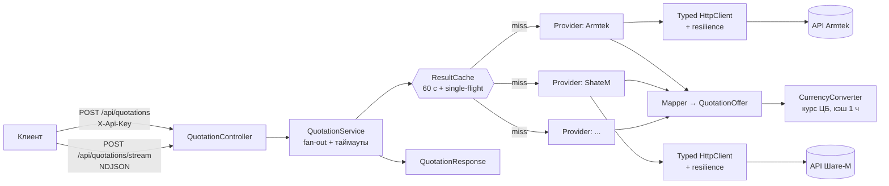

# Архитектура SupplierQuotationApi

Отдельный сервис проценки: один POST-запрос, ответ от десятков API поставщиков в единой структуре.
С Studio2Prod не связан ни кодом, ни БД. Своё хранилище не нужно: сервис stateless, кэш — в памяти.

## Схема



## Слои

| Слой | Папка | Ответственность |
|---|---|---|
| API | `Controllers/` | HTTP, валидация, X-Api-Key. Без логики. |
| Contracts | `Contracts/` | Публичные модели запроса/ответа. Не зависят от провайдеров. |
| Core | `Core/` | `QuotationService`, кэш результатов, single-flight, конвертер валют. |
| Providers | `Providers/<Имя>/` | Всё про одного поставщика: `Options`, `Client`, `Mapper`, `Provider`, регистрация. |
| Infrastructure | `Infrastructure/` | Загрузка `.env`, ключ API, Http-политики, логирование. |

Зависимости идут только вниз: Providers знает Contracts и Core-интерфейсы, Core не знает конкретных поставщиков.

## Скорость

1. **Fan-out**: все поставщики опрашиваются параллельно (`Task.WhenAll`), общее время = самый медленный, а не сумма.
2. **Таймаут на поставщика** (по умолчанию 20 с, настраивается): медленный не задерживает остальных, получает статус `Timeout`.
3. **Стриминг**: `POST /api/quotations/stream` отдаёт NDJSON — результат каждого поставщика уходит клиенту сразу по готовности. Первые цены видны через сотни мс.
4. **Кэш результата** 60 с по ключу `(provider, article, brand, includeAnalogs)` с single-flight: одинаковые одновременные запросы делают один вызов к поставщику.
5. **Кэш справочников** (`IMemoryCache`): токены/сессии, справочники складов (например, Шате-М locations, 30 мин), курсы валют (1 ч).
6. **Переиспользование соединений**: `IHttpClientFactory` + typed clients, `PooledConnectionLifetime`, HTTP/2 где поддерживается. Свои `HttpClient` не создаются.
7. **Устойчивость** (`Microsoft.Extensions.Http.Resilience`): retry с backoff только на идемпотентных GET/поиске, circuit breaker на упавшего поставщика — он мгновенно получает `Error`, а не ждёт таймаут.
8. **Лимиты**: `SemaphoreSlim` на поставщика там, где у API rate limit (ZZap `MinRequestIntervalMs`).

## Расширяемость

Добавить поставщика = одна папка + одна строка регистрации:

```
Providers/ShateM/
  ShateMOptions.cs      // привязка SUPPLIERS__SHATEM__*
  ShateMClient.cs       // HTTP к API, DTO ответа
  ShateMMapper.cs       // DTO → QuotationOffer
  ShateMProvider.cs     // IQuotationProvider
  ShateMExtensions.cs   // services.AddShateM(config)
```

- **Один API, несколько аккаунтов** (Forum-Auto ×5, FavoritParts ×3, Armtek RU/BY): одна реализация класса, много экземпляров с разными ключами и `AccountLogin`. Не копировать контроллеры, как в Studio2.
- **Включение автоматическое**: поставщик `IsEnabled`, только если заполнены его обязательные переменные. Пустой `.env`-блок = выключен.
- **Единый контракт** `IQuotationProvider`: ядро не знает, как устроен API. Кроссы фильтруются в провайдере (по умолчанию только оригиналы).
- **Логотипы**: файл `wwwroot/logos/<Key>.svg`, URL отдаётся в ответе.

## Единый вид запроса и ответа

- Запрос: `POST /api/quotations` — `article`, `brand?`, `providers?[]`, `includeAnalogs?`.
- Ответ: `providers[]` — `providerKey`, `providerName`, `logoUrl`, `accountLogin`, `status`, `error`, `durationMs`, `offers[]`.
- Оффер: `productName`, `brand`, `article`, `warehouse`, `stock`, `stockText`, `minOrderQuantity`, `deliveryDaysMin/Max`, `price {amount,currency}`, `priceRub`, `offerId`, `providerData`.

## Подключённые поставщики

| Ключ | Поставщик | Особенности |
|---|---|---|
| `ShateM` | Шате-М | REST, Bearer, цены BYN → RUB; поиск артикулов по коду, бренд локально |
| `Armtek`, `ArmtekBy` | Armtek RU/BY | form-POST, Basic; для RU нужен адрес доставки (`DELIVERYKUNNR`), суточная квота |
| `FavoritParts`, `…Istra`, `…Rostov` | FavoritParts ×3 | ключи в query, срок по московской дате |
| `ForumAuto`, `…Interparts`, `…Piter`, `…Rostov`, `…Istra` | Forum-Auto ×5 | общий каталог, разные склады |
| `Avd` | АВД | SOAP, агрегатор: поставщик и регион в каждой строке |
| `Berg` | Берг | ключ в заголовке, адрес отгрузки задаёт сроки |
| `Motex` | МоТехС | Bearer; доступ по белому списку IP клиента |
| `MlAuto`, `MlAutoRu` | ML-Auto BY/RU | нужен бренд в точном написании (пробуются варианты) |
| `MoskvorechieIstra` | Москворечье | портал (cookie, windows-1251), API запасным путём |
| `ProfitLiga` | Профит-Лига | ключ в query, PHP-коллекции |
| `Japarts` | Japarts | windows-1251; SQL API не экранирует апострофы — небезопасные значения не отправляются |
| `Nikei` | Nikei | Basic; без бренда отдаёт список брендов |
| `MikadoMskHod20` | Микадо | SOAP, нужен бренд; пустой список без `Message = Ok` — ошибка |
| `ZZapMoscow` | ZZap Москва | агрегатор продавцов; лимит 1 запрос в 3,5 с на весь процесс, обязательна подпись источника |

## Секреты

Все секреты — в одном файле `.env` (в `.gitignore`), шаблон без значений — `.env.example`.
Формат один для всех: `SUPPLIERS__<ПОСТАВЩИК>__<ПОЛЕ>` (двойное подчёркивание = вложенность конфигурации ASP.NET, регистр не важен). Ключ самого сервиса — `APP__APIKEY`.
Значения скопированы из `appsettings.json` Studio2Prod (22 поставщика, 68 переменных). В логи и ответы секреты не попадают; наружу уходит только `accountLogin`.

## Алиасы производителей (база Studio2)

Поставщики называют бренды по-разному: в заказе «Kayaba», у Berg, Armtek и ML-Auto — «KYB». Без словаря такие предложения
отбрасываются как чужой бренд. Словарь лежит в таблице `OneCProducerAliases` базы Studio2 (схема `ST2`, десятки строк,
правится вручную), сервис читает её сам:

- `Core/ProducerAliases/ProducerAliasService` читает таблицу через MySqlConnector и кэширует на 30 минут; один загрузчик на все
  параллельные запросы. Нормализация и схлопывание цепочек `A→B→C` повторяют Studio2.
- `ProducerAliasMap.Matches` — общее правило сравнения брендов для всех провайдеров: нормализация, алиас, вхождение
  («MAHLE» ↔ «MAHLE ORIGINAL»). `QueryVariants` даёт написания для API, которые ищут только по точному имени
  (ML-Auto, МоТехС): исходное, без знаков (`WYNN'S` → `WYNNS`) и алиасы.
- Подключение: `STUDIO2DB__CONNECTIONSTRING` в `.env`. Пусто — алиасы выключены, проценка работает как раньше.
- Только чтение: каждая сессия открывается с `SET SESSION TRANSACTION READ ONLY`, запрашивается одна таблица.
- База недоступна — не ошибка: сервис пишет предупреждение, работает без алиасов и повторяет попытку через две минуты.

Рекомендуется отдельный пользователь БД с правом `SELECT` только на `ST2.OneCProducerAliases`:

```sql
CREATE USER 'quotation_ro'@'%' IDENTIFIED BY '<пароль>';
GRANT SELECT ON ST2.OneCProducerAliases TO 'quotation_ro'@'%';
```

## Наблюдаемость

Структурные логи (`ILogger`) с `provider`, `durationMs`, `status`; `GET /health`; длительность каждого поставщика — в самом ответе.

## Порядок реализации

1. Infrastructure: загрузка `.env`, X-Api-Key, `/health`.
2. Core: кэш + single-flight, `CurrencyConverter`, стриминг.
3. Провайдеры по очереди, начиная с ShateM (простой REST), затем Armtek, FavoritParts, Forum-Auto, остальные.
